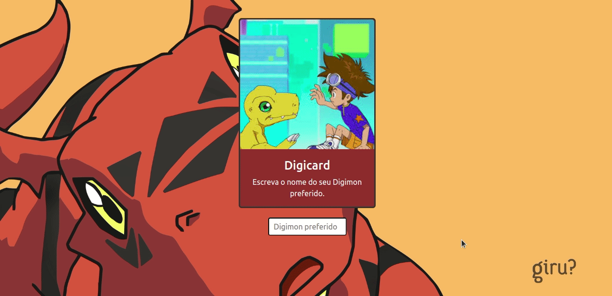

# Digicards

<!-- ALL-CONTRIBUTORS-BADGE:START - Do not remove or modify this section -->

<!-- ALL-CONTRIBUTORS-BADGE:END -->

Projeto rápido feito para consumo de API para estudo e treinamento.

  

## Tecnologias

Tecnologias, ferramentas e API utilizadas no desenvolvimento do projeto:

- [VS Code](https://code.visualstudio.com/) com [ESLint](https://eslint.org/)
- [API](https://digimon-api.vercel.app/api/digimon)

 

## Contributors ✨

Thanks goes to these wonderful people 🥂
<!-- ALL-CONTRIBUTORS-LIST:START - Do not remove or modify this section -->
<!-- prettier-ignore-start -->
<!-- markdownlint-disable -->
<table>
  <tr>
    <td align="center"><a href="https://github.com/PedroHasseDev"> <b>Pedro H. Niemczewski</b></a> <a href="#ideas-PedroHasseDev" title="Ideas, Planning, & Feedback">🤔</a> <a href="https://github.com/rafaelftourinho/digicards" title="Code">💻</a></td>
    <td align="center"><a href="https://github.com/rafaelftourinho"> <b>Rafael França</b></a> <a href="https://github.com/rafaelftourinho/digicards" title="Code">💻</a></td>
    <td align="center"><a href="https://github.com/lucasrodrigges"> <b>Lucas Rodrigues</b></a> <a href="https://github.com/rafaelftourinho/digicards" title="Code">💻</a></td>

  </tr>
</table>

<!-- markdownlint-restore -->
<!-- prettier-ignore-end -->
